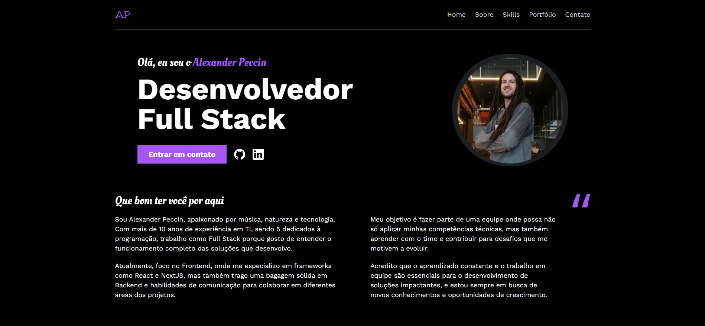

# 🚀 Portfolio

This project aims to serve not only as my portfolio but also to practice technologies such as NextJS, TypeScript and Tailwind, ensuring responsiveness on any device.

Esse projeto tem como objetivo, além de ser meu portfólio, treinar tecnologias tais como: NextJS, TypeScript e Tailwind, garantindo responsividade em qualquer dispositivo.

## :computer: Features / Funcionalidades

- Full responsiveness
- Internationalization

## :hammer: Stack / Tecnologias utilizadas

- **HTML**
- **Javascript**
- **Next**
- **Tailwind**
- **Intl**

**Link:** [https://portifolio-iota-bay.vercel.app/](https://portifolio-iota-bay.vercel.app/)

### :raising_hand: Autor

- **Website:**  [Alexander Peccin](https://portifolio-iota-bay.vercel.app/)
- **Linkedin:**  [Alexander Peccin](https://www.linkedin.com/in/alexander-peccin-616192106/)